<p align="center"></p>

<p align="center">
  <a href="https://payoffchain.tech"></a>
  
  <a href="https://robinhoodchain.blockscout.com/address/0xBbe366a496637aa72Fc98edAA8dC9fe7Fd3b9132?tab=contract"></a>
  
</p>

<p align="center"></p>

# PAYOFF

Self-repaying loans on **Robinhood Chain**. Put your tokenized stocks in as collateral and borrow USDG against them. The borrowed USDG goes to work in the **Uniswap V3** pool for that same stock, every trading fee it earns goes onto your debt, and the loan pays itself down while you keep the shares.

Non-custodial: every loan lives in its own vault contract that you own. The automation that works on it can never withdraw.

## What is in the repo

| Part | Where | Runs on |
|---|---|---|
| Smart contracts (`PayoffVaultFactory`, `PayoffVault`) | `contracts/` | Robinhood Chain |
| Web app and API (Next.js) | `app/`, `lib/` | Vercel |
| Auto-repay runner | `agent/` | Railway |

## The vault

One `PayoffVault` per loan, cloned by the factory. The collateral backs the loan under the vault's own name, and the borrowed USDG stays in the vault until it is placed in the pool as a position the vault owns.

* **Owner** (your wallet): deposit, withdraw (always to the owner), set the policy, choose the operator, allow markets, pause, hand the vault to a new owner in two steps.
* **Operator** (auto-repay): borrow within your ceiling, open and close liquidity in the vault's own pair and only in the pools you allowed, collect fees onto the debt, move the loan to a cheaper market you allowed, repay early before liquidation.
* **Nobody** can send a token anywhere except the protocols the vault uses, the treasury's capped fee, and the owner.

Every swap is floored by the market's price oracle less your slippage setting, and every new position first checks the pool price against the same oracle. If the oracle cannot be read, the vault refuses to trade. The owner can always close a position and take everything out, oracle or not.

Fees: 2.5% of collected trading fees and 10% of profit when a position closes above cost, never on a loss. The caps (5% and 20%) are written into the vault and cannot be raised. Borrowing, moving markets and liquidation protection are free.

## The brain

`lib/services/plan.ts` is the whole decision procedure: **protect → move to a cheaper market → close → collect fees → put idle USDG to work**. The site shows it for any vault under "What happens next", and the runner signs exactly that. Every action is simulated before it is sent.

## Contracts

```bash
npm install
npm run compile
npm test                  # contract tests
npm run deploy:contracts  # deploys the factory and the vault implementation
```

Live on Robinhood Chain, source verified:

* Factory `0xBbe366a496637aa72Fc98edAA8dC9fe7Fd3b9132`
* Vault implementation `0x8d9b9fBDF65b1AFCed5c5f275093e0884d816D61`

## Web app

```bash
npm run dev
```

See `.env.example` for the settings. The server holds no key: every write route returns unsigned calldata that the user's wallet signs.

## Auto-repay runner

```bash
PAYOFF_API_URL=https://payoffchain.tech AGENT_PRIVATE_KEY=<operator key> AGENT_DRY_RUN=false npm run agent
```

It starts in dry-run, checks every vault it operates once a minute, simulates each transaction before signing, caps gas, and refuses to sign when its own balance runs low.

## Tests

* `npm test` — contracts: factory, policy, borrow and repay, liquidity, fee collection, refinancing, protection, permissions, operator limits.
* `npm run test:ts` — tick maths, rate maths, token metadata, runner safety checks.
* `npm run test:fork` — the full flow against the live protocols on a fork of Robinhood Chain.

## License

MIT
